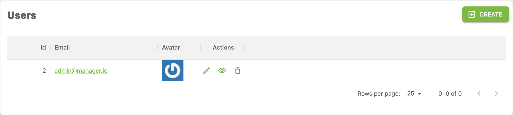

# Admin Panel

Example application using frameworks that get you to your business relevant needs as quick as possible. Automatic user interface generation with [Refine](https://refine.dev/docs/getting-started/quickstart/) and unique resource centric architecture by [FeathersJS](https://feathersjs.com/guides/basics/generator.html) that allows developers to immediately start coding business logic.


**Figure X.X CRUD capabilities with minimal effort using Refine and FeathersJS. You can add business logic via FeathersJS hooks.**
# Develop

Backend:
Using Feathers CLI 🎉 to handle service creation.

Frontend:
Using `dataProvider={dataProvider("http://localhost:3030/")}` to connect to Feathers backend (served on port `3030`). Refine automatically creates forms from data it receives using an [Inferencer](https://refine.dev/docs/packages/documentation/inferencer/). You can always customize Refine [data providers](https://refine.dev/docs/tutorial/understanding-dataprovider/index/) and/or [components](https://refine.dev/docs/tutorial/adding-crud-pages/mui/index/).

You can add a user by sending a request with `./scripts/add-example-user.sh` (if not already exists).


```bash
# Setup
npm run migrate # Create db
# Add user

# Start frontend and backend (local directories are mounted as volumes)
docker compose up

# Create file for db migration
npm run migrate:make -- <migration-name>
npm run migrate # Edit file then run

# Test
cd backend: npm test # Test backend with Mocha
```
